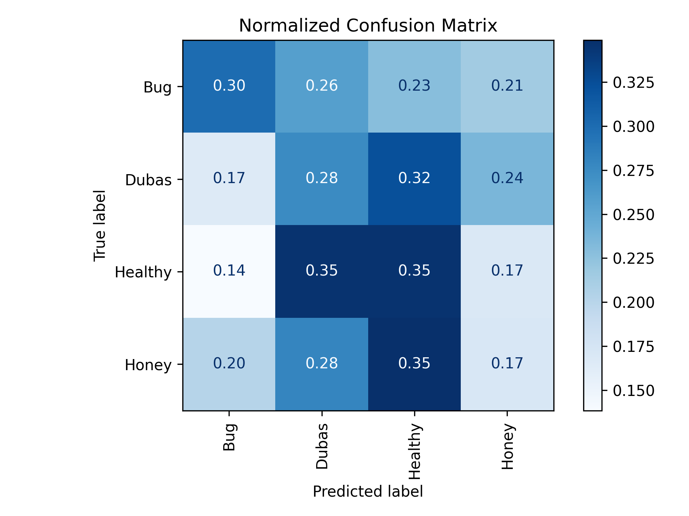

# Automatic Plant Diagnosis  
Deep Learning vs Classical Machine Learning for Plant Disease Classification

## Abstract

This project presents a comparative study between Deep Learning and Classical Machine Learning approaches for automated plant disease diagnosis using image data.

The problem is formulated as a **supervised multi-class image classification task**, where an input image of a plant leaf is mapped to a predefined disease category.

A **transfer learning-based Convolutional Neural Network (MobileNetV2)** is compared against a **PCA + Support Vector Machine (SVM)** pipeline. The objective is to evaluate performance, robustness, and scalability across fundamentally different paradigms.

Results demonstrate the superiority of deep learning models for high-dimensional visual data, while classical methods provide a valuable interpretable baseline.

---
```text
## Project Architecture

Automatic_Plant_Diagnosis/
│
├── data/ # Dataset (not included)
│ ├── raw/ # Original dataset
│ │ └── Palm_Leaves_Dataset/
│ │
│ └── synthetic/ # Generated dataset (augmentation-based)
│
├── models/ # Saved models & artifacts (ignored)
│ ├── plant_cnn.keras
│ ├── training_history.pkl
│ ├── ml_accuracy.pkl
│ └── class_names.pkl
│
├── figures/ # Generated plots
│
├── config.py # Central configuration (paths, hyperparameters)
├── train.py # CNN training + fine-tuning pipeline
├── model.py # CNN architecture (MobileNetV2)
├── load_data.py # Data loading and preprocessing
├── generate_synthetic.py # Synthetic dataset generation
├── ml_pipeline.py # PCA + SVM pipeline with cross-validation
├── plot_results.py # Evaluation plots and metrics
├── predict.py # Inference script (single image prediction)
│
├── requirements.txt
├── .gitignore
└── README.md
```
The repository follows a modular and reproducible research-oriented structure.

---

## Dataset

This project uses the **Palm Leaf Disease Dataset**.

Source:
https://www.kaggle.com/code/rabiehoussaini/palm-deseas-detection/input

⚠️ The dataset is not included in this repository.

### Expected structure:

```text
Expected structure:
data/raw/Palm_Leaves_Dataset/
├── class_1/
├── class_2/
├── class_3/
└── ...

Each folder represents a disease category.
```

---
## Problem Formulation

The task is defined as:

- **Input**: RGB image of a plant leaf  
- **Output**: Probability distribution over disease classes  

The predicted label corresponds to: argmax P(y | x)

This is a **supervised multi-class classification problem**.

## Methodology

### 🔵 Deep Learning Approach

- **Model**: MobileNetV2 (pretrained on ImageNet)
- **Transfer Learning**:
  - Frozen base model (feature extractor)
  - Fine-tuning of top layers
- **Preprocessing**:
  - MobileNetV2 normalization
- **Data Augmentation**:
  - Flip, rotation, zoom, brightness, contrast
- **Regularization**:
  - Dropout
  - Batch normalization
- **Optimization**:
  - Adam optimizer
  - Learning rate scheduling
  - Early stopping

The CNN automatically learns hierarchical visual features from raw images.

---

### 🟠 Classical Machine Learning Approach

- Image resizing + grayscale conversion
- Flattening (vectorization)
- Standardization
- PCA (dimensionality reduction)
- SVM (RBF kernel)
- 5-Fold Stratified Cross-Validation

This pipeline provides:
- Lower computational cost
- Interpretable feature compression
- Baseline comparison

---

### 🟣 Synthetic Data Generation

A secondary dataset is generated using data augmentation:

- Random flip
- Rotation
- Zoom
- Contrast / brightness variation

Purpose:
- Increase dataset diversity
- Improve model generalization
- Reduce overfitting

---

## Experimental Results

| Model | Accuracy |
|-------|----------|
| CNN | ~82% |
| PCA + SVM | ~35% |
| K-Fold Mean Accuracy | ~35% |
| K-Fold Std | ~0.011 |

### Interpretation

- CNN significantly outperforms classical ML on image data
- PCA introduces information loss
- Transfer learning improves convergence and accuracy
- SVM remains a useful lightweight baseline

### Model Performance plots

#### CNN Accuracy


#### CNN Loss


### Confusion Matrix


#### Top 10 worst recall


#### f1 per class


#### Model Comparison


---

## Installation

Clone repository:
```bash
git clone https://github.com/Mira-Allali/Automatic_Plant_Diagnosis.git
cd Automatic_Plant_Diagnosis
```

Create environment:
```bash
conda create -n plant_cnn python=3.11
conda activate plant_cnn
```

Install dependencies:
```bash
pip install -r requirements.txt
```

---

## Usage

Train CNN: python train.py

Generate Synthetic Dataset: python generate_dataset2.py

Run ML pipeline: python ml_pipeline.py

Plot Results: python plot_results.py

Predict on New Image: python predict.py

---

## Reproducibility

- Dataset must be manually downloaded from Kaggle.
- Paths must match config.py
  

- Dependencies listed in `requirements.txt`
- Designed to be OS-independent (Windows / Linux / macOS)

---

## Technical Stack

- Python 3.11
- TensorFlow / Keras
- Scikit-learn
- NumPy
- Matplotlib
- OpenCV

---

## Key Contributions

- Transfer learning-based CNN pipeline
- Synthetic dataset generation
- Comparative ML baseline (PCA + SVM)
- Cross-validation evaluation
- Full inference pipeline (predict.py)
- Reproducible modular architecture

---

## Limitations

- Dataset size may limit generalization
- Synthetic data may introduce bias
- No real-time deployment yet

---

## Future Work

- Grad-CAM interpretability
- Deployment (Streamlit / FastAPI)
- Edge optimization (quantization)
- Larger real-world datasets
- Multi-disease detection per image
---

## Author

Mira Allali — PhD Researcher (Networks & Security)
Berrached Assia — PhD Researcher (Architecture)
Cherki Asma Nada — PhD Researcher (English Literature and Civilisation)
Mechache Hadil Hadjer — PhD Researcher (English Language and Culture)
Mouharar Ahlam — PhD Researcher (English Language and Culture)

---

## License

This repository is intended for academic and research purposes.


