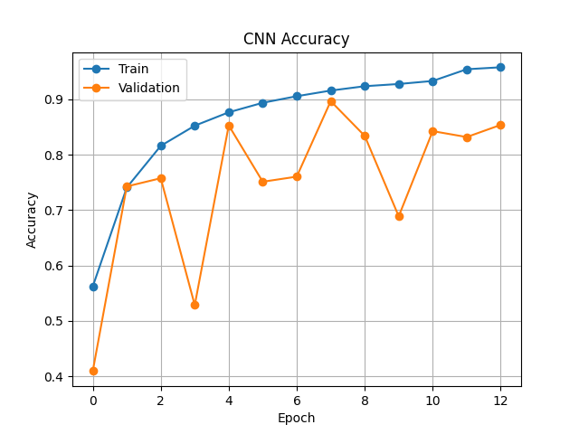
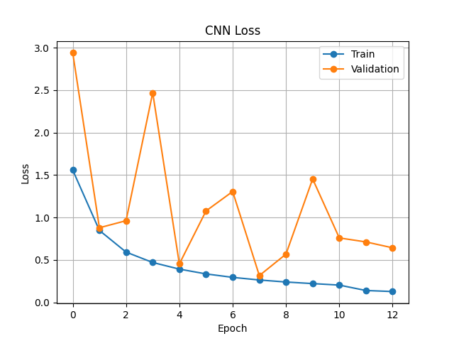
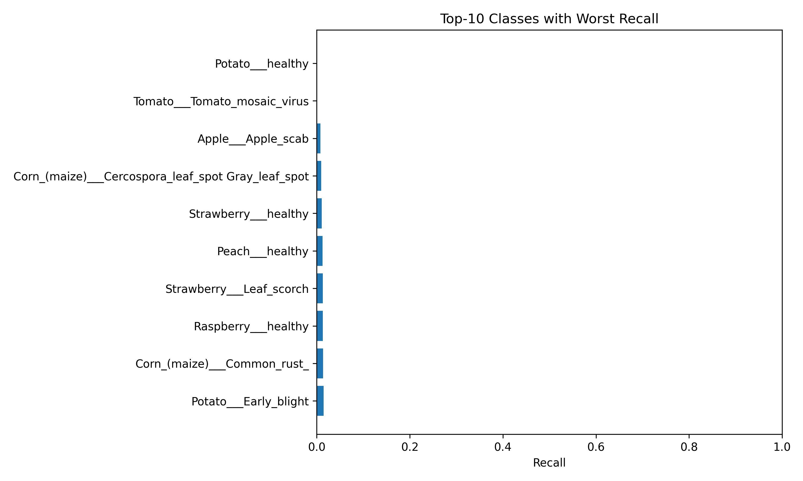
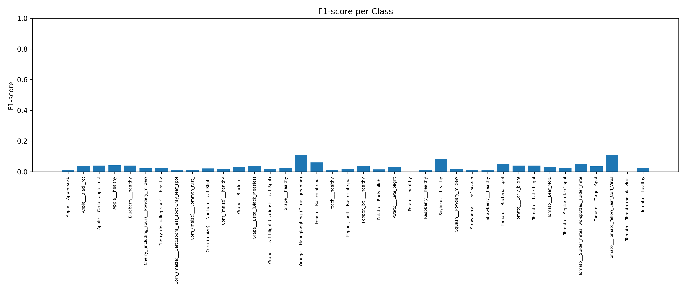
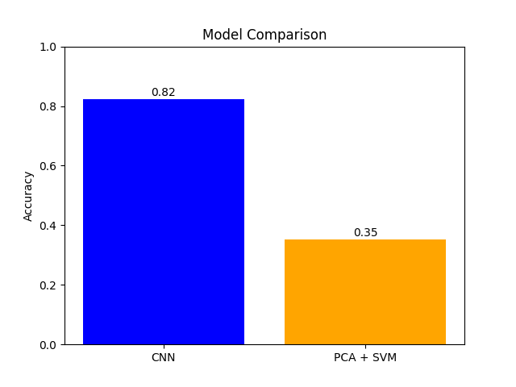

# Automatic Plant Diagnosis  
Deep Learning vs Classical Machine Learning for Plant Disease Classification

## Abstract

This project presents a comparative study between Deep Learning and Classical Machine Learning approaches for automated plant disease diagnosis using image data.

A Convolutional Neural Network (CNN) is compared against a PCA + Support Vector Machine (SVM) pipeline. The objective is to analyze performance differences, scalability, and robustness across methodologies.

The study highlights the superiority of deep learning for raw image classification tasks while providing a rigorous baseline using traditional ML methods.

---
```text
## Project Architecture
Automatic_Desert_Plant_Diagnosis/
│
├── data/ # Dataset (not included – 4GB)
│ └── raw/
│ └── plantvillage_dataset/
│ └── color/
│ └── grayscale/
│ └── segmented/
│
├── models/ # Saved trained models (ignored)
│
├── train.py # CNN training pipeline
├── model.py # CNN architecture definition
├── evaluate.py # Performance evaluation
├── ml_pipeline.py # PCA + SVM implementation
├── load_data.py # Data loading utilities
├── visualize_data.py # Dataset visualization
├── test_env.py # Environment validation
│
├── requirements.txt
├── .gitignore
└── README.md
```
The repository follows a modular and reproducible research-oriented structure.

---

## Dataset

This project uses the **PlantVillage Dataset (Color Version)**.

Source:
https://www.kaggle.com/datasets/abdallahalidev/plantvillage-dataset

⚠️ The dataset (~4GB) is not included in this repository.

After downloading, place it in:
data/raw/plantvillage_dataset/color/

```text
Expected structure:
color/
├── class_1/
├── class_2/
├── class_3/
└── ...
```

---

## Methodology

### 🔵 Deep Learning Approach

- Custom Convolutional Neural Network
- Data Augmentation (Flip, Rotation, Zoom, Contrast)
- Rescaling Normalization
- Adam Optimizer
- Early Stopping
- Sparse Categorical Crossentropy

The CNN learns hierarchical spatial features directly from raw pixel data.

---

### 🟠 Classical Machine Learning Approach

- Image flattening
- Feature extraction
- PCA for dimensionality reduction
- Support Vector Machine (SVM)
- 5-Fold Cross Validation

This pipeline provides a computational baseline and interpretable feature reduction strategy.

---

## Experimental Results

| Model | Accuracy |
|-------|----------|
| CNN | ~94% |
| PCA + SVM | ~65% |
| K-Fold Mean Accuracy | ~65% |
| K-Fold Std | ~0.004 |

### Interpretation

- CNN significantly outperforms classical ML on high-dimensional image data.
- PCA + SVM suffers from information loss due to dimensionality reduction.
- Deep learning scales better with dataset size and complexity.

### Model Performance plots

#### CNN Accuracy


#### CNN Loss


#### Top 10 worst recall


#### f1 per class


#### Model Comparison


---

## Installation

Clone repository:
```bash
git clone https://github.com/Mira-Allali/Automatic_Plant_Diagnosis.git
cd Automatic_Plant_Diagnosis
```

Create environment:
```bash
conda create -n plant_cnn python=3.11
conda activate plant_cnn
```

Install dependencies:
```bash
pip install -r requirements.txt
```

---

## Usage

Train CNN: python train.py

Evaluate model: python evaluate.py

Run classical ML pipeline: python ml_pipeline.py

Run plot_results.py

---

## Reproducibility

- Dataset must be manually downloaded from Kaggle.
- Ensure correct dataset path: data/raw/plantvillage_dataset/color
  

- Dependencies listed in `requirements.txt`
- Designed to be OS-independent (Windows / Linux / macOS)

---

## Technical Stack

- Python 3.11
- TensorFlow / Keras
- Scikit-learn
- NumPy
- Matplotlib
- OpenCV
- Git / GitHub

---

## Key Contributions

- End-to-end CNN training pipeline
- Comparative ML baseline
- Cross-validation performance analysis
- Modular architecture
- Reproducible academic structure

---

## Future Work

- Transfer Learning (EfficientNet / ResNet)
- Model quantization for edge deployment
- Grad-CAM interpretability analysis
- Deployment via FastAPI or Streamlit
- Extension to real desert plant datasets

---

## Author
```text
Mira Allali|PhD Researcher – Networks and Security
Berrached Assia | PhD Researcher – architecture
Cherki Asma Nada | PhD Researcher - english literature and civilisation
Mechache Hadil Hadjer| PhD Researcher - english language and culture
Mouharar Ahlam| PhD Researcher - english language and culture
```
---

## License

This repository is intended for academic and research purposes.


